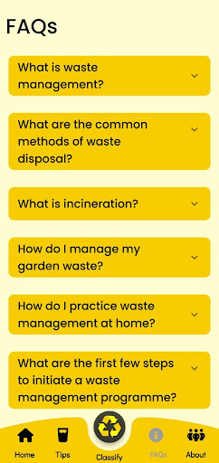

# TrashCan
An application to segregate waste using deep learning.

<!---Link to Kaggle Notebook :

https://www.kaggle.com/code/suvooo/garbage-classification-keras-transfer-learning/edit -->
## Research Work :
Our paper titled ‘Application to segregate Waste using Deep Learning’  was presented at “International
Conference on Advances in Computer Engineering, Communication Systems and Business Development
(ICACECSBD-2023)”. It is also included in the conference proceedings book and will be published further in a scopus indexed journal.

[Conference Proceeding Book ICACECSBD-23](https://drive.google.com/file/d/1jtTjzMKKeL91yI-7oSEZqDmXmGQSFUw8/view?usp=sharing)  

## Preview : 

 &ensp;&ensp;&ensp;&ensp;&ensp;&ensp;&ensp;&ensp;&ensp;
 &ensp;&ensp;&ensp;&ensp;&ensp;&ensp;&ensp;&ensp;&ensp; 
 &ensp;&ensp;&ensp;&ensp;&ensp;&ensp;&ensp;&ensp;&ensp;
 &ensp;&ensp;&ensp;&ensp;&ensp;&ensp;&ensp;&ensp;&ensp;
 &ensp;&ensp;&ensp;&ensp;&ensp;&ensp;&ensp;&ensp;&ensp;
 &ensp;&ensp;&ensp;&ensp;&ensp;&ensp;&ensp;&ensp;&ensp;
<!--  &ensp;&ensp;&ensp;&ensp;&ensp;&ensp;&ensp;&ensp;&ensp; -->

## Our Product
[Click here to download](https://drive.google.com/file/d/1ujjMqUEvZjh8KxDD7aw4_DXdvRBaiEgQ/view?usp=sharing)  

 &ensp;&ensp;&ensp;&ensp;&ensp;&ensp;&ensp;&ensp;&ensp;

## Supervisor
### Dr. S. Babu 

## Team

<table
<tr align="center">

<td>

Suvodeep Sinha

</td>

<td>

Abhigyan Singh

</td>

<td>

Naman Jain

</td>

</tr>

  </table>

