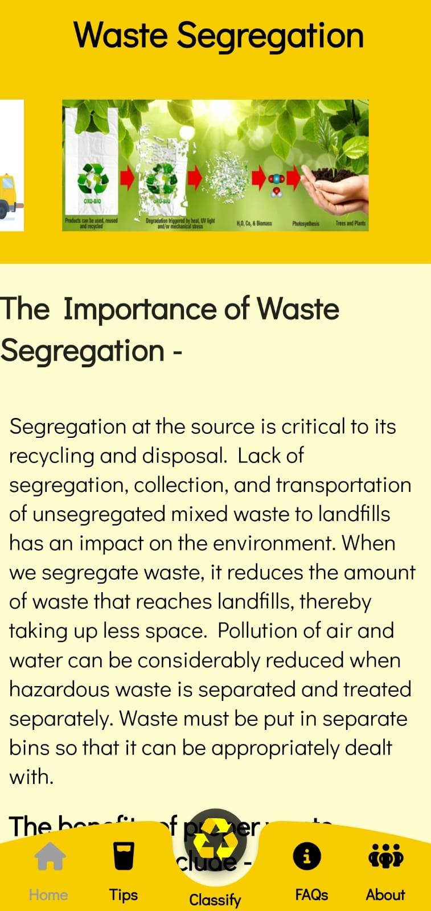
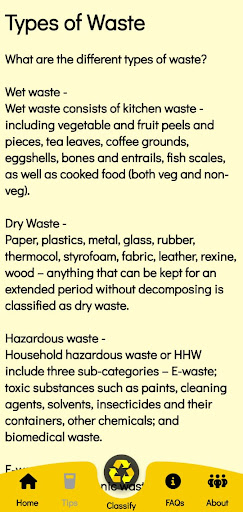
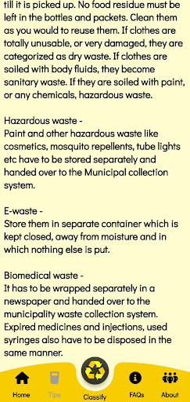
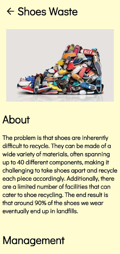
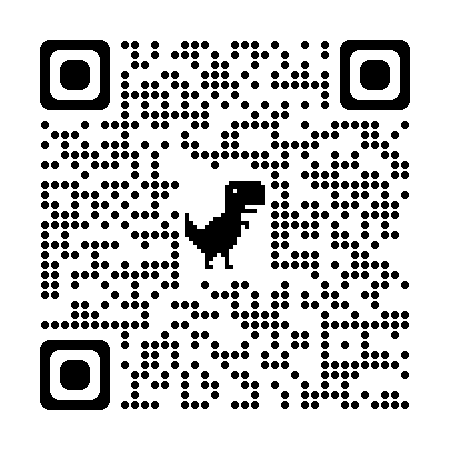

# TrashCan
Minor Project for 7th Semester CSE - 18CSP107L 

Link to Kaggle Notebook :

https://www.kaggle.com/code/suvooo/garbage-classification-keras-transfer-learning/edit

## Project Review
- Review 0 - 16 August 2022
- Review 1 - 23 September 2022
- Review 2 - 14 October 2022
- Review 3 - 05 November 2022

## Preview : 

 &ensp;&ensp;&ensp;&ensp;&ensp;&ensp;&ensp;&ensp;&ensp;
 &ensp;&ensp;&ensp;&ensp;&ensp;&ensp;&ensp;&ensp;&ensp; 
 &ensp;&ensp;&ensp;&ensp;&ensp;&ensp;&ensp;&ensp;&ensp;
 &ensp;&ensp;&ensp;&ensp;&ensp;&ensp;&ensp;&ensp;&ensp;
 &ensp;&ensp;&ensp;&ensp;&ensp;&ensp;&ensp;&ensp;&ensp;
 &ensp;&ensp;&ensp;&ensp;&ensp;&ensp;&ensp;&ensp;&ensp;

## Our Product
[Click here to download](https://drive.google.com/file/d/1WGyjP_dSOpoTMVstzfxC8CUooF86fvI-/view?usp=sharing)  

## Supervisor
- Dr. S. Babu 

## Team
- Naman Jain
- Suvodeep Sinha
